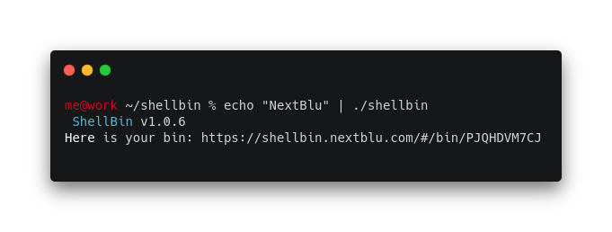

# What's that? ShellBin! 👩‍💻👨‍💻

Here at NextBlu we often deal with very different environments, different technologies and different things to work on..   
But do you know what we all have in common? Sooner or later we will have to open a terminal and share our information with the rest of the team.

## Introducing ShellBin

ShellBin is a simple, fast and cool system where we share our internal bin. 

We decided to create this open-source project to be able to create a quick and easy way to capture the result of our work. 

ShellBin is available in two versions:

* A [CLI](https://github.com/nextblu/shellbin/releases)
* [Web version](https://shellbin.nextblu.com/#/)

Here you can find quick tutorials and informations about this project:





