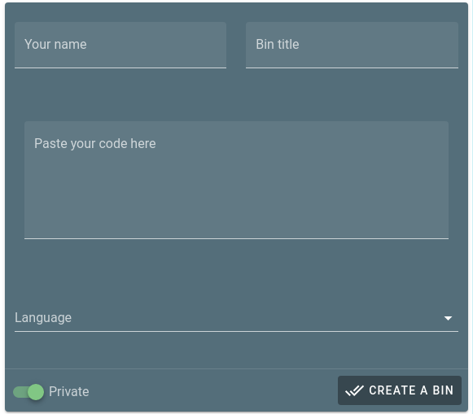

# Let's use the web version 🕸️

## ShellBin web, uh?

ShellBin web is a VueJS project that has the primary objective of allowing the sharing, creation and management of your bins.

### How to I access the web version?

You can access the web version by clicking on the following link:



### How do I create a Bin?

Scroll down, and locate the bin area. Here you can find this little badge where you can type your information and most importantly, paste your code.

Only the `Code` and the `Language` are required, but if you plan to share the bin with a friend a title and your name may make it look better.

#### Let's jump to the action, actual bin creation

After entering all the information you want to enter, you are ready to go: click on "Create a Bin".

### Et voilà

You will be automatically redirected to the page with your bin, and now you can share the url with your friends or colleagues.

