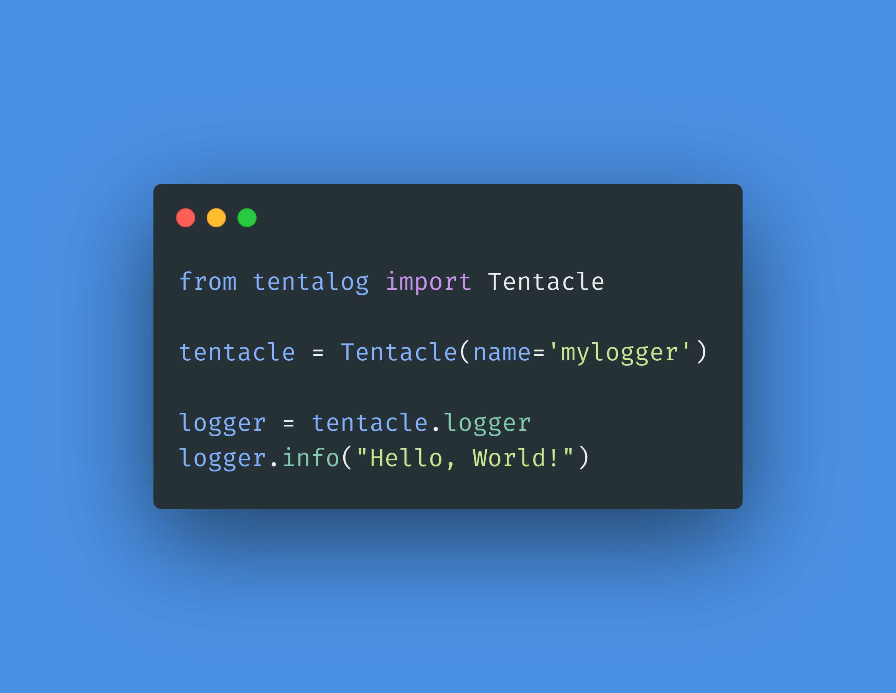

# What is TentaLog

We managed to integrate a simplier configuration-flow to ensure a quick integration in every app. You can configure your logging with a YAML file. A simple and light weight logging configuration is provided by default. We brought in this library our logging best practices ready to use with the default configuration.

The _Tentacle_ is the single unit of **TentaLog**, managing a single logger. To start logging with tentacle you can follow the quick-start guide on GitHub. This code will use the tentalog default configuration, that contains the configuration of two logging handlers, one for the console and one for a time based file rotation of 15 days. If the "mylogger" logger is not found in configuration, the "root" logger will be used and a warning message will be showed. If the name of the logger is not specified, the "root" logger will be used. If you want to use a custom configuration you can just initialize your Tentacle in a similar way with a YAML file.

