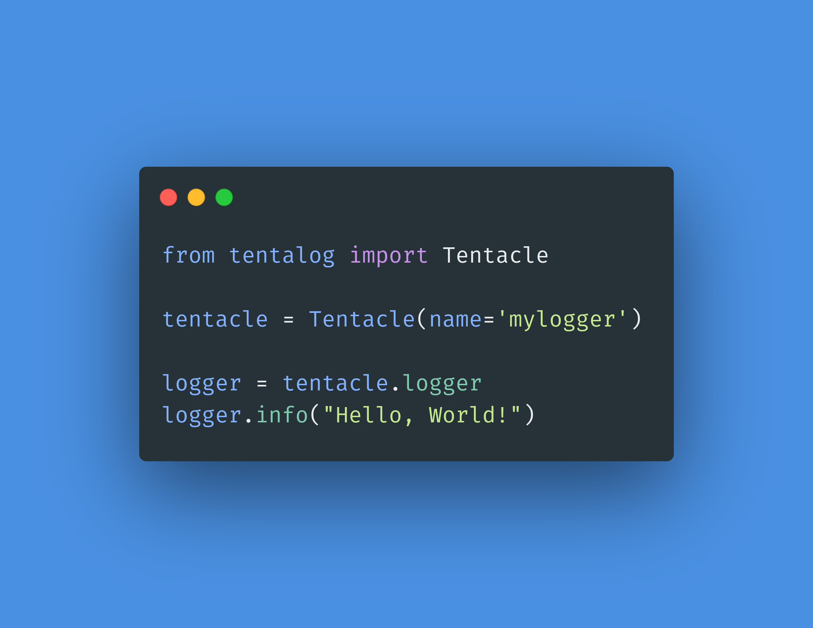

# Quick and dirty start

TentaLog has been designed to be used immediately after installation. We propose a basic configuration always available in order to have a logging system in few seconds.



### So, where do we start?

The Tentacle is the single unit of TentaLog, managing a single logger. To start logging with tentacle you can do something like this:

```text
from tentalog import Tentacle

tentacle = Tentacle(name='mylogger')

logger = tentacle.logger
logger.info("Hello World")
```

This code will use the tentalog default configuration, that contains the configuration of two logging handlers, one for the console and one for a time based file rotation of 15 days. If the "mylogger" logger is not found in configuration, the "root" logger will be used and a warning message will be showed. If the name of the logger is specified, the "root" logger will be used. 


